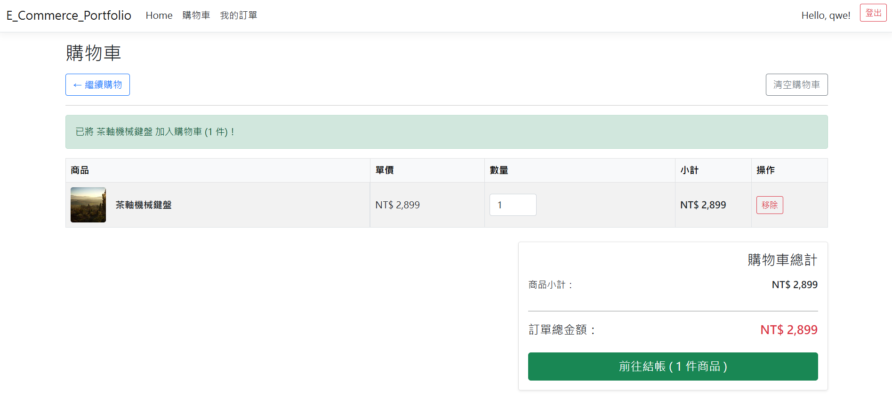
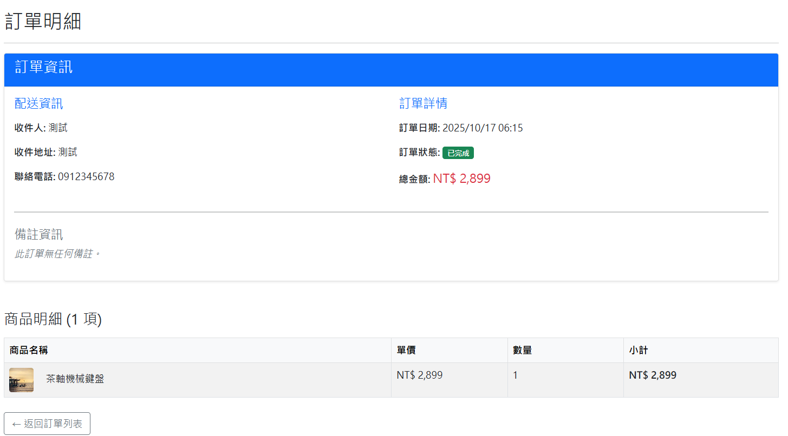
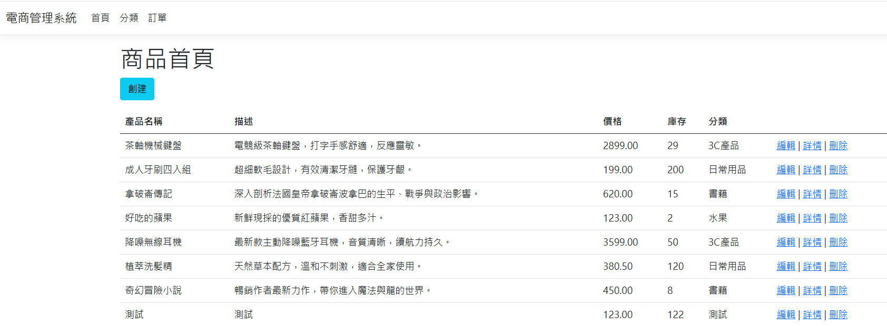
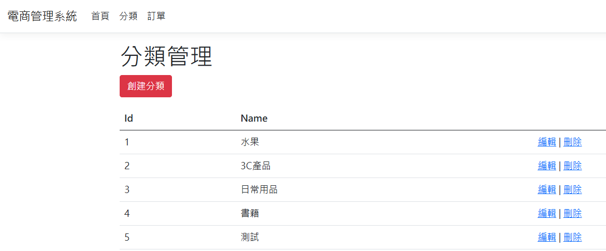
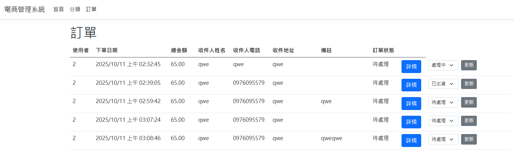

# ECommerce

由 ASP.NET Core MVC 與 EF Core 打造的電商網站與管理後台，採用 Code-First 建表與多對多關聯設計，支援分頁、搜尋、排序、驗證與以 Session 管理購物車，提供完整前後台購物流程示範。

## 目錄

- 專案簡介
- 功能特色
- 技術棧
- 系統需求
- 使用說明
- 畫面展示
- 資料庫關聯
- 作者

## 專案簡介

此專案展示以 ASP.NET Core MVC（.NET 8）與 Entity Framework Core 建置的電商網站，包含前台購物流程與後台管理。適合用於框架學習、作品集或作為電商系統的起始範本。

## 功能特色

- 前台功能
  - 登入／註冊
  - 商品列表（分頁、搜尋、排序）
  - 購物車（加入、更新、刪除）
  - 下單／結帳
  - 訂單查詢
- 後台功能
  - 商品管理
  - 分類管理
  - 訂單管理
- 技術特性
  - EF Core Code-First、資料表遷移（Migrations）
  - 多對多關聯設計（產品 ↔ 分類）
  - 驗證機制與錯誤處理
  - Razor View + Bootstrap 樣式

## 技術棧

- ASP.NET Core MVC（.NET 8）
- Entity Framework Core（Code-First）
- Razor View
- Bootstrap

## 系統需求

- `.NET SDK 8.x`
- `SQL Server`（LocalDB／Express／或其他相容資料庫）
- EF Core CLI（選用）：`dotnet-ef`

## 使用說明

- 前台流程
  - 註冊／登入 → 瀏覽商品 → 加入購物車 → 結帳 → 查詢訂單。
- 後台管理
  - 透過後台頁面進行商品、分類與訂單管理。
- 常見設定
  - 連線字串：請確認資料庫可連線並具備建立／更新資料表權限。
  - 若調整模型或關聯，請建立並套用新的 Migrations。

## 畫面展示

### 前台

1. 首頁

2. 商品列表

3. 購物車

4. 下單

5. 訂單明細

### 後台

1. 商品管理

2. 分類管理

3. 訂單管理

## 資料庫關聯

- 使用者 → 訂單 → 訂單項目 → 產品
- 產品 ↔ 分類（多對多關聯）

## 作者

李柏駿（Bo-Chun Lee）

📍 Taiwan ｜ 💻 ASP.NET Core MVC / Web API / EF Core