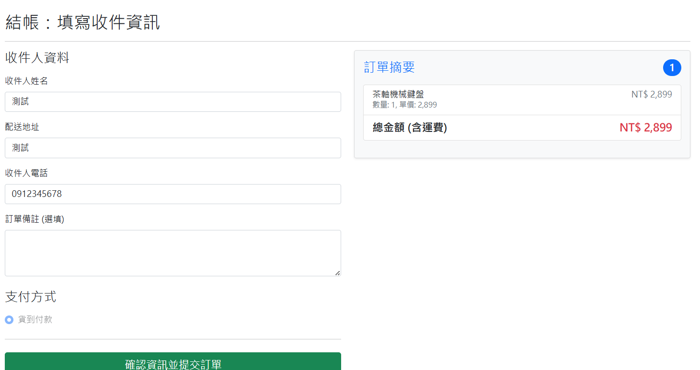

# ECommerce

由 ASP.NET Core MVC 與 EF Core 打造的電商網站與管理後台，採用 Code-First 建表與多對多關聯設計，支援分頁、搜尋、排序、驗證與以 Session 管理購物車，提供完整前後台購物流程示範。

## 目錄

- 專案簡介
- 功能特色
- 技術棧
- 系統需求
- 安裝指南
- 使用說明
- 畫面展示
- 資料庫關聯
- 貢獻方式
- 授權資訊
- 作者

## 專案簡介

此專案展示以 ASP.NET Core MVC（.NET 8）與 Entity Framework Core 建置的電商網站，包含前台購物流程與後台管理。適合用於框架學習、作品集或作為電商系統的起始範本。

## 功能特色

- 前台功能
  - 登入／註冊
  - 商品列表（分頁、搜尋、排序）
  - 購物車（加入、更新、刪除）
  - 下單／結帳
  - 訂單查詢
- 後台功能
  - 商品管理
  - 分類管理
  - 訂單管理
- 技術特性
  - EF Core Code-First、資料表遷移（Migrations）
  - 多對多關聯設計（產品 ↔ 分類）
  - 驗證機制與錯誤處理
  - Razor View + Bootstrap 樣式

## 技術棧

- ASP.NET Core MVC（.NET 8）
- Entity Framework Core（Code-First）
- Razor View
- Bootstrap

## 系統需求

- `.NET SDK 8.x`
- `SQL Server`（LocalDB／Express／或其他相容資料庫）
- EF Core CLI（選用）：`dotnet-ef`

## 安裝指南

1. 下載或複製專案
   - 直接下載 ZIP 並解壓縮；或使用 Git：
     - `git clone <your-repo-url>`
2. 還原與建置
   - 在專案根目錄執行：
     - `dotnet restore`
     - `dotnet build`
3. 設定資料庫連線
   - 於 `appsettings.json` 設定 `ConnectionStrings:DefaultConnection`（請依您的環境調整）。
4. 套用資料庫（若已建立 Migrations）
   - 安裝 EF 工具（如未安裝）：`dotnet tool install --global dotnet-ef`
   - 套用資料庫：`dotnet ef database update`
5. 啟動網站
   - `dotnet run`
   - 依命令列顯示的 URL 進入（例如 `http://localhost:5000/`，實際埠號以輸出為準）。

## 使用說明

- 前台流程
  - 註冊／登入 → 瀏覽商品 → 加入購物車 → 結帳 → 查詢訂單。
- 後台管理
  - 透過後台頁面進行商品、分類與訂單管理。
- 常見設定
  - 連線字串：請確認資料庫可連線並具備建立／更新資料表權限。
  - 若調整模型或關聯，請建立並套用新的 Migrations。

## 畫面展示

### 前台

1. 首頁

2. 商品列表

3. 購物車

4. 下單

5. 訂單明細

### 後台

1. 商品管理

2. 分類管理

3. 訂單管理

## 資料庫關聯

- 使用者 → 訂單 → 訂單項目 → 產品
- 產品 ↔ 分類（多對多關聯）

## 貢獻方式

- 歡迎 Issue 與 Pull Request：
  - Fork 本專案
  - 建立分支：`git checkout -b feature/your-feature`
  - 提交變更：`git commit -m "feat: add your feature"`
  - 推送分支：`git push origin feature/your-feature`
  - 建立 Pull Request 並說明內容與影響範圍
- 建議遵循
  - C# 命名與 MVC 分層慣例
  - 保持一致的格式與必要註解
  - 為重大變更附上測試或操作說明

## 授權資訊

本專案採用 MIT License。您可自由使用、修改與散布；若需要不同授權條款，請與作者聯繫。

## 作者

李柏駿（Bo-Chun Lee）

📍 Taiwan ｜ 💻 ASP.NET Core MVC / Web API / EF Core